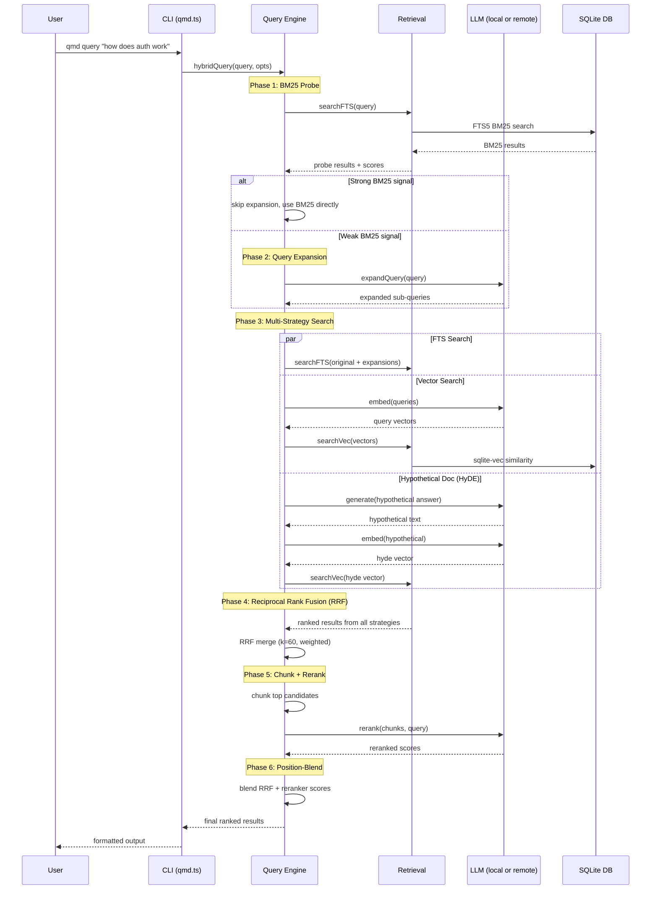
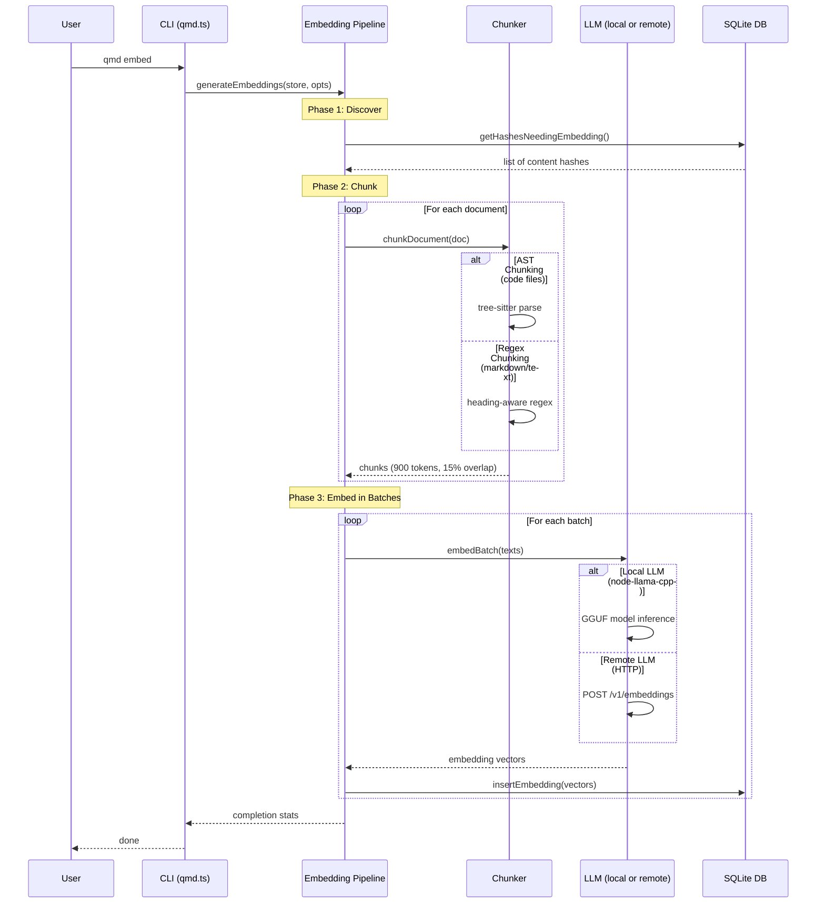
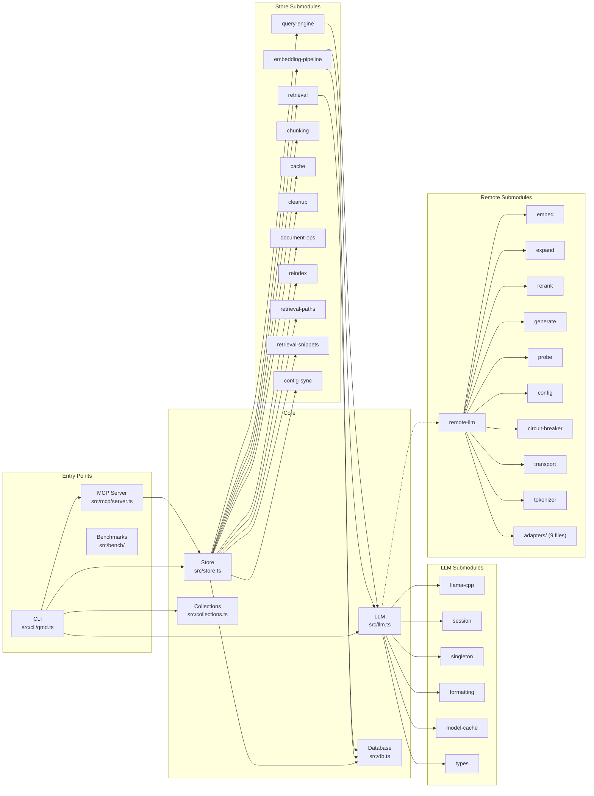

# QMD Architecture

## System Overview

```mermaid
graph TB
    subgraph "CLI Layer (src/cli/)"
        QMD["qmd.ts<br/>Main Entry Point"]
        PARSE["parse.ts<br/>CLI Argument Parsing"]
        CMDS["commands/<br/>collections, context,<br/>mcp, skills, doctor"]
        FMT["formatter.ts<br/>search-formatting.ts<br/>Output Formatting"]
        LC["lifecycle.ts<br/>command-lifecycle.ts<br/>DB/LLM Lifecycle"]
    end

    subgraph "MCP Server (src/mcp/)"
        MCP_SRV["server.ts<br/>MCP Server"]
        MCP_TOOLS["tools.ts<br/>MCP Tool Definitions"]
        MCP_HTTP["transports/http.ts<br/>HTTP Transport"]
        MCP_INST["instructions.ts<br/>Agent Instructions"]
    end

    subgraph "Collections Config (src/collections.ts)"
        YAML["YAML Config<br/>~/.config/qmd/index.yml"]
        CTX["Context Management<br/>Per-path descriptions"]
    end

    subgraph "Store Layer (src/store.ts + src/store/)"
        STORE["store.ts<br/>Store Factory"]
        QENGINE["query-engine.ts<br/>Hybrid/Vector/Structured<br/>Query Orchestration"]
        RETRIEVAL["retrieval.ts<br/>FTS + Vector Search<br/>RRF Fusion"]
        EMBPIPE["embedding-pipeline.ts<br/>Embedding Generation<br/>Pipeline"]
        CHUNK["chunking.ts<br/>chunking-async.ts<br/>Regex + AST Chunking"]
        CACHE["cache.ts<br/>LLM Response Cache"]
        CLEANUP["cleanup.ts<br/>DB Maintenance"]
        DOCUMENT["document-ops.ts<br/>Document CRUD"]
        REINDEX["reindex.ts<br/>Collection Re-indexing"]
        CONFIGSYNC["config-sync.ts<br/>YAML → DB Sync"]
        RSNIPS["retrieval-snippets.ts<br/>Snippet Extraction"]
        RPATHS["retrieval-paths.ts<br/>Virtual Path Resolution"]
    end

    subgraph "LLM Abstraction (src/llm.ts + src/llm/)"
        LLM_BARREL["llm.ts<br/>LLM Interface + Re-exports"]
        LLAMA["llama-cpp.ts<br/>node-llama-cpp<br/>Local GGUF Models"]
        SESSION["session.ts<br/>LLM Session Management"]
        SINGLETON["singleton.ts<br/>Global LLM Instance"]
        LLM_FMT["formatting.ts<br/>Prompt Formatting<br/>(Nomic / Qwen3)"]
        MCACHE["model-cache.ts<br/>Model Download +<br/>GGUF Cache"]
        LLM_TYPES["types.ts<br/>LLM Type Definitions"]
    end

    subgraph "Remote LLM (src/remote/ + embedding-provider.ts)"
        REMOTE_LLM["remote-llm.ts<br/>RemoteLLM Class<br/>LLM Interface over HTTP"]
        EMBED["embed.ts<br/>Embedding API"]
        EXPAND["expand.ts<br/>Query Expansion"]
        RERANK["rerank.ts<br/>Reranking API"]
        GENERATE["generate.ts<br/>Text Generation"]
        PROBE["probe.ts<br/>Health Checks"]
        CONFIG["config.ts<br/>Endpoint Resolution<br/>Env + YAML"]
        CB["circuit-breaker.ts<br/>Retry + Backoff"]
        TRANSPORT["transport.ts<br/>HTTP Client"]
        TOKENIZER["tokenizer.ts<br/>Remote Tokenizer"]
        LOG["log.ts<br/>Structured Logging"]

        subgraph "Adapters (src/remote/adapters/)"
            ADAPT_REG["registry.ts<br/>Adapter Resolution"]
            OAI_EMBED["openai-chat.ts<br/>openai-completions.ts<br/>openai-responses.ts<br/>OpenAI Embeddings"]
            COHERE["cohere-embed.ts<br/>cohere-rerank.ts<br/>Cohere APIs"]
            OLLAMA["ollama-embed.ts<br/>ollama-text.ts<br/>Ollama APIs"]
            VLLM["vllm-pooling.ts<br/>vllm-score.ts<br/>vLLM APIs"]
            ANTHROPIC["anthropic-messages.ts<br/>Anthropic Messages"]
            LEGACY["legacy.ts<br/>Legacy Formats"]
            NORM["normalization.ts<br/>Score Normalization"]
        end
    end

    subgraph "Database (src/db.ts)"
        DB["SQLite Database<br/>~/.cache/qmd/index.sqlite"]
        FTS5["FTS5<br/>Full-Text Search (BM25)"]
        VEC["sqlite-vec<br/>Vector Similarity"]
    end

    subgraph "Infrastructure"
        AST["ast.ts<br/>Tree-sitter AST Chunking"]
        GLOB["glob-patterns.ts<br/>Glob Pattern Utilities"]
        PATHS["paths.ts<br/>Path Resolution"]
        MAINT["maintenance.ts<br/>Index Maintenance"]
    end

    %% CLI → Store
    QMD --> STORE
    QMD --> YAML
    QMD --> MCP_SRV

    %% Store internals
    STORE --> QENGINE
    STORE --> RETRIEVAL
    STORE --> EMBPIPE
    STORE --> CHUNK
    STORE --> CACHE
    STORE --> CLEANUP
    STORE --> DOCUMENT
    STORE --> REINDEX
    STORE --> CONFIGSYNC
    STORE --> RSNIPS
    STORE --> RPATHS

    %% Query Engine → Retrieval
    QENGINE --> RETRIEVAL
    QENGINE --> CHUNK
    QENGINE --> CACHE

    %% Retrieval → DB
    RETRIEVAL --> FTS5
    RETRIEVAL --> VEC

    %% Store → DB
    EMBPIPE --> VEC
    DOCUMENT --> DB
    REINDEX --> DB

    %% Store → LLM
    EMBPIPE --> LLM_BARREL
    QENGINE --> LLM_BARREL
    RETRIEVAL --> LLM_BARREL

    %% LLM Internal
    LLM_BARREL --> LLAMA
    LLM_BARREL --> SESSION
    LLM_BARREL --> MCACHE
    LLM_BARREL --> LLM_FMT
    SESSION --> SINGLETON

    %% LLM → Remote
    LLM_BARREL -.-> REMOTE_LLM

    %% Remote Internals
    REMOTE_LLM --> EMBED
    REMOTE_LLM --> EXPAND
    REMOTE_LLM --> RERANK
    REMOTE_LLM --> GENERATE
    REMOTE_LLM --> PROBE
    REMOTE_LLM --> CONFIG
    REMOTE_LLM --> CB
    CB --> TRANSPORT
    EMBED --> ADAPT_REG
    EXPAND --> ADAPT_REG
    RERANK --> ADAPT_REG
    GENERATE --> ADAPT_REG
    PROBE --> ADAPT_REG

    %% MCP → Store
    MCP_SRV --> STORE
    MCP_SRV --> MCP_TOOLS
    MCP_SRV --> MCP_HTTP
    MCP_SRV --> MCP_INST

    %% Collections Config → Store
    CONFIGSYNC --> YAML

    %% Infrastructure
    CHUNK --> AST
    REINDEX --> GLOB
    STORE --> PATHS
    STORE --> MAINT
```



## Query Pipeline (qmd query)



## Embedding Pipeline (qmd embed)



## Module Dependency Map



## Key Architectural Patterns

### 1. Barrel / Facade Pattern
- `src/store.ts` re-exports from `src/store/*` submodules
- `src/llm.ts` re-exports from `src/llm/*` submodules
- `src/embedding-provider.ts` re-exports from `src/remote/*`

### 2. LLM Interface Abstraction
Both local (`node-llama-cpp`) and remote (HTTP API) LLM backends implement the
same `LLM` interface (`src/llm/types.ts`), allowing the query engine and
embedding pipeline to work transparently with either backend.

### 3. Adapter Pattern (Remote)
`src/remote/adapters/registry.ts` maps API format strings
(e.g. `openai_chat_completions`, `cohere_v2_embed`) to adapter implementations
that normalize provider-specific wire protocols into QMD's internal types.

### 4. Reciprocal Rank Fusion (RRF)
The Query Engine combines results from BM25 (FTS5), vector similarity
(sqlite-vec), and HyDE (hypothetical document embeddings) using RRF with
k=60, weighted by query source (2.0× for original query, 1.0× for expansions).

### 5. Pipeline Architecture
Search follows a staged pipeline: BM25 probe → signal assessment → conditional
expansion → multi-strategy search → RRF fusion → chunking → cross-encoder
reranking → position-aware score blending → output.

### 6. Collection-Scoped Multi-Tenancy
Collections (configured in YAML) scope documents, contexts, and LLM model
routing. Each collection can have its own base path, glob pattern, update
command, and per-path context descriptions.

## Storage Schema

| Table | Purpose |
|-------|---------|
| `documents` | File metadata (path, hash, title, collection, timestamps) |
| `content` | Raw document text keyed by content hash |
| `content_vectors` | Chunk embeddings indexed via sqlite-vec |
| `llm_cache` | Cached LLM responses (expansion, rerank) |
| `contexts` | Per-collection, per-path human-written descriptions |
| `fts_docs` | FTS5 virtual table for full-text search |
| `embedding_fingerprints` | Tracks which (hash, model) pairs have vectors |

## Directory Structure

```
src/
├── cli/                    # CLI entry point and commands
│   ├── qmd.ts              # Main CLI dispatch
│   ├── parse.ts            # Argument parsing
│   ├── lifecycle.ts        # DB/LLM lifecycle management
│   ├── command-lifecycle.ts
│   ├── formatter.ts        # Output formatting (JSON, CSV, MD, XML)
│   ├── search-formatting.ts
│   └── commands/           # Subcommand handlers
│       ├── collections.ts
│       ├── context.ts
│       ├── mcp.ts
│       ├── skills.ts
│       └── doctor.ts
├── store.ts                # Store facade (barrel)
├── store/                  # Store submodules
│   ├── query-engine.ts     # Hybrid query orchestration
│   ├── retrieval.ts        # FTS + Vector + RRF
│   ├── embedding-pipeline.ts
│   ├── chunking.ts         # Regex chunking
│   ├── chunking-async.ts   # AST-aware chunking
│   ├── cache.ts            # LLM response cache
│   ├── cleanup.ts          # DB maintenance
│   ├── document-ops.ts
│   ├── reindex.ts
│   ├── retrieval-paths.ts
│   ├── retrieval-snippets.ts
│   ├── config-sync.ts
│   ├── path-utils.ts
│   └── db-init.ts
├── llm.ts                  # LLM facade (barrel)
├── llm/                    # LLM submodules
│   ├── llama-cpp.ts        # node-llama-cpp binding
│   ├── session.ts          # Session management
│   ├── singleton.ts        # Global LLM instance
│   ├── formatting.ts       # Prompt templates
│   ├── model-cache.ts      # GGUF download cache
│   └── types.ts            # LLM interface types
├── remote/                 # Remote LLM over HTTP
│   ├── remote-llm.ts       # RemoteLLM class
│   ├── embed.ts            # Embedding API client
│   ├── expand.ts           # Query expansion client
│   ├── rerank.ts           # Reranking API client
│   ├── generate.ts         # Text generation client
│   ├── probe.ts            # Health/model checks
│   ├── config.ts           # Endpoint resolution
│   ├── circuit-breaker.ts  # Retry + backoff
│   ├── transport.ts        # HTTP transport
│   ├── tokenizer.ts        # Remote tokenizer
│   ├── log.ts              # Structured logging
│   ├── types.ts            # Remote config types
│   └── adapters/           # Provider-specific adapters
│       ├── registry.ts
│       ├── normalization.ts
│       ├── anthropic-messages.ts
│       ├── cohere-embed.ts
│       ├── cohere-rerank.ts
│       ├── legacy.ts
│       ├── ollama-embed.ts
│       ├── ollama-text.ts
│       ├── openai-chat.ts
│       ├── openai-completions.ts
│       ├── openai-responses.ts
│       ├── vllm-pooling.ts
│       └── vllm-score.ts
├── mcp/                    # MCP server
│   ├── server.ts
│   ├── tools.ts
│   ├── instructions.ts
│   └── transports/
│       └── http.ts
├── collections.ts          # YAML collection config
├── db.ts                   # SQLite database wrapper
├── ast.ts                  # Tree-sitter AST chunking
├── paths.ts                # Path resolution utilities
├── glob-patterns.ts        # Glob pattern handling
├── maintenance.ts          # Index maintenance
├── embedding-provider.ts   # Backward-compat barrel → src/remote/
├── index.ts                # Public API exports
└── bench/                  # Benchmarking tools
    ├── bench.ts
    ├── score.ts
    └── types.ts
```
